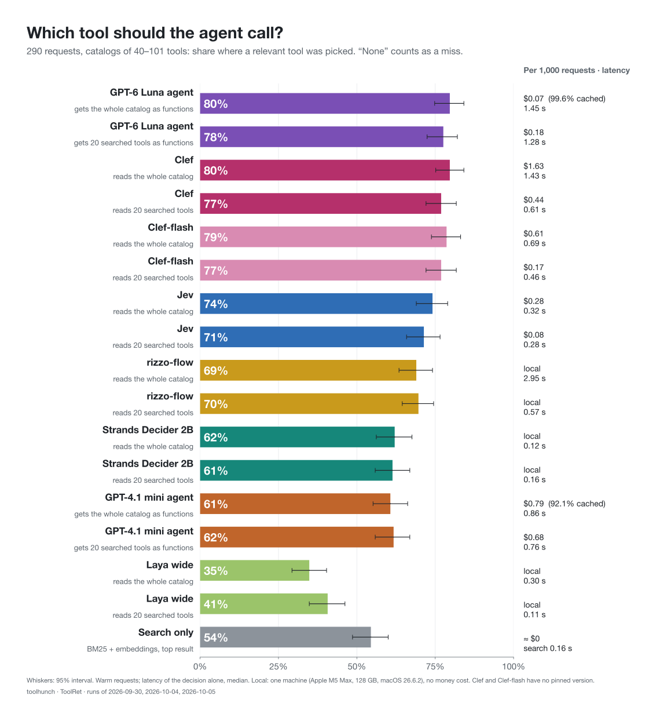
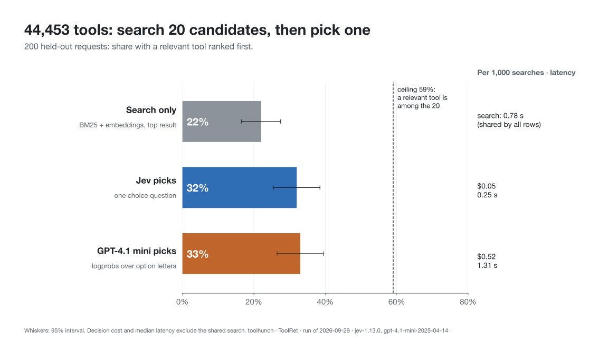
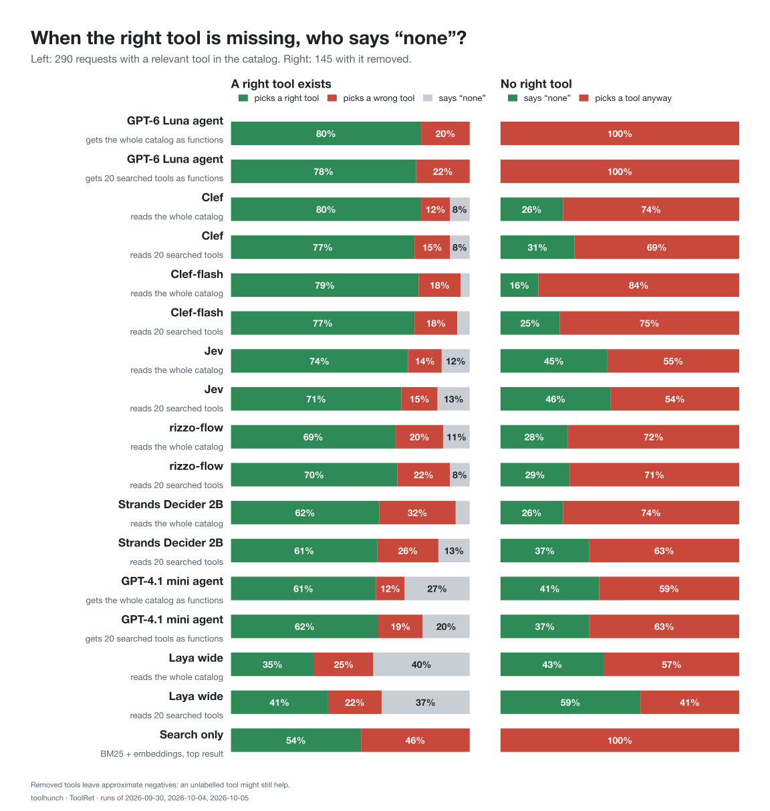
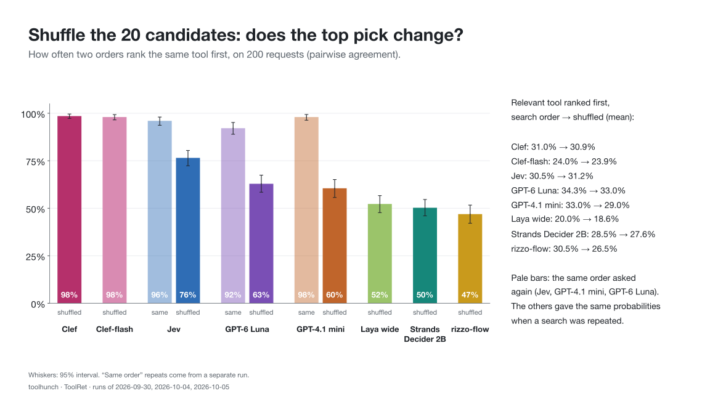

<p align="center">
  <picture>
    <source media="(prefers-color-scheme: dark)" srcset="assets/brand/toolhunch-logo-white.png">
    
  </picture>
</p>

<p align="center"><b>Your agent has too many tools and calls the wrong one.<br>
toolhunch searches them, lets a fast decision model pick, and can say “none”.</b></p>

<p align="center">
  
  
  
  
  
  
</p>



On catalogs of 40–101 tools, Jev picked a relevant tool for **74%** of 290 requests. A GPT-4.1 mini agent
given every tool as a function picked one for **61%**, at nearly three times the cost and latency.
[Results and limits below](#results).

## Why search tools at all?

An agent usually receives every tool definition on every call. That is fine for a handful of tools, but:

- **Context and cost.** Every definition takes context-window space and input tokens on every call.
- **Hard limits.** OpenAI rejected our request with 200 functions (`array_above_max_length`).
- **Caching helps, within limits.** Prompt caching makes a fixed tool list cheaper, but the list still
  fills the context, and changing it breaks the cache.

What we measured: at 40–101 tools, GPT-4.1 mini did as well with every tool as with 20 searched ones,
and caching kept the cost close ($0.79 against $0.68 per 1,000 requests). Search earns its place as catalogs grow:
hundreds of MCP tools, or ToolRet's 44,453.

## How it works

```text
request ──► search (BM25 + embeddings) ──► 20 candidates ──► decider ──► one tool, or “none”
```

- **Search** ranks tools by keywords (BM25) and by meaning (embeddings), merged with reciprocal rank fusion.
- **A decider** reads the request and the candidates, then picks one or answers “none”. It can be a System-1
  decision model such as [TypeSafe's Jev](https://docs.typesafe.ai), a Jev-compatible server
  ([Laya](https://github.com/NandhaKishorM/laya), [rizzo-flow](https://github.com/Rizzo-AI-Academy/rizzo-flow)),
  or an LLM whose token probabilities (logprobs) rank the options.
- **Two ways to use a decider:** after search, on the 20 candidates, at any catalog size; or instead of search,
  reading the whole catalog, when it is small.

The pipeline ranks tools; an integration decides how they reach the agent. The core is framework-free.

## Results

The data is [ToolRet](https://arxiv.org/abs/2503.01763) (Shi et al., Findings of ACL 2025): requests labelled
with the tools that solve them, over a 44,453-tool corpus. “Relevant” means one of the labelled tools. These
tests measure tool selection on single-turn requests, not task completion. Intervals are 95% bootstrap intervals
over tasks; every figure is generated from a published summary.

### 1. Small catalogs: read everything, or search first?

Four ToolRet catalogs of 40–101 tools, with the same 290 requests for every strategy (chart above):

| Strategy | Relevant tool picked (95% CI) | Cost / 1,000 requests | Median latency |
|---|---:|---:|---:|
| Jev reads the whole catalog | **74.1%** (69.0–79.0) | $0.28 | 0.32 s |
| Search, then Jev picks among 20 | 71.4% (65.9–76.6) | $0.08 | 0.45 s |
| GPT-4.1 mini agent, 20 searched tools | 61.7% (55.9–66.9) | $0.68 | 0.94 s |
| GPT-4.1 mini agent, whole catalog | 60.7% (55.2–66.2) | $0.79 (92% cached) | 0.86 s |
| Search only, top result | 54.5% (48.6–60.0) | ≈ $0 | 0.16 s |

The agent makes one function-calling request; its first call is scored, never executed. Costs and latency are
for warm requests, after the first of each catalog, and include search where a strategy searches first.

### 2. 44,453 tools: search, then decide



On 200 held-out requests, search alone puts a relevant tool first 22% of the time. A decider over the 20
candidates raises that to 32% (Jev) or 33% (GPT-4.1 mini logprobs): the same precision, with Jev about 10×
cheaper ($0.05 against $0.52 per 1,000 searches) and 5× faster (0.25 against 1.31 s). Search is the limit:
a relevant tool is among the 20 candidates only 59% of the time. With 50 candidates the ceiling is 71.5%,
and Jev reaches 37.0%.

### 3. When no tool fits

To test “none”, we remove the labelled tools from some requests and check who notices. The same answer can be
read in three ways:

| Reading | The decider… |
|---|---|
| Answer always | must pick a tool |
| Allow “none” | may answer “none of these” |
| Confidence threshold | answers only when its probability is at least 0.95 (chosen on dev data), otherwise “none” |



On small catalogs, with “none” allowed: when no right tool existed, Jev said “none” 45% of the time and
the GPT-4.1 mini agent 41%, so both usually picked something anyway. When a right tool existed, the agent said
“none” to 27% of requests, Jev to 12%.

A threshold is no cure either. At 44,453 tools, on 200 requests with a relevant tool and 200 without:

| Jev, 20 candidates | Right | Wrong | “None” |
|---|---:|---:|---:|
| Answer always | 64 | 336 | 0 |
| Allow “none” | 64 | 265 | 71 |
| Threshold 0.95 | 20 | 29 | 351 |

Without a relevant tool any pick is wrong, so “answer always” is wrong at least 200 times by design.
The threshold removed about 9 in 10 wrong picks, and 2 in 3 right ones. GPT-4.1 mini gives 66/334/0, 61/272/67
and 52/215/133 for the same readings.

### 4. Does the order of the candidates matter?

A common criticism of decision models is that shuffling the options changes the answer. We asked the same
200 questions with the 20 candidates in five orders: search order and four shuffles.



- **Both change their pick.** Two orders agree on the top tool 76.5% of the time for Jev and 60.5%
  for GPT-4.1 mini logprobs, against 96–98% when the same order is repeated.
- **Only GPT's precision moved.** A relevant tool came first 30.5% → 31.2% (mean of the shuffles) for Jev,
  and 33.0% → 29.0% for GPT-4.1 mini, lower in all four shuffles.
- **Position bias.** GPT-4.1 mini picked one of the first three slots 23.2% of the time, Jev 18.2%; a uniform
  pick gives 15%.
- **Averaging five orders did not help** (31.5% Jev, 31.0% GPT) and costs five decisions per search.

The same-order repeats come from a separate run, so this is an observational comparison.

### 5. Prompt caching

For the GPT-4.1 mini agent given the whole catalog, OpenAI served 92% of input tokens from its prompt cache
on warm requests: $0.79 per 1,000 instead of $2.43 at list price. With 20 searched tools the list changes
on every request, and nothing was cached ($0.68). Jev's provider-side caching was not measured.
Multi-turn agent loops, where caching and tool reveal interact, come next.

The [technical page](docs/experiments/toolret.md) has the protocol, every table, per-catalog results,
latency, thresholds and limitations.

## Quickstart

Not on PyPI yet. Clone and install the workspace, then set `TYPESAFE_API_KEY` (and `OPENAI_API_KEY` for
the agent) in your environment or a local `.env`:

```shell
git clone https://github.com/dfm88/toolhunch && cd toolhunch && uv sync --all-packages
```

```python
import anyio

from toolhunch import Abstention, BM25Retriever, ChoiceDecider, ToolCard, ToolCatalog, ToolSearchPipeline, jev

catalog = ToolCatalog(
    [
        ToolCard(name="get_weather", description="Get the current weather in a city."),
        ToolCard(name="send_email", description="Send an e-mail message to a recipient."),
        # ... the rest of your tools
    ]
)
pipeline = ToolSearchPipeline(
    BM25Retriever(),  # 1. search: keep 20 candidates
    decider=ChoiceDecider(jev("jev-1.13.0"), abstention=Abstention()),  # 2. pick one, or "none"
    k=20,
    top_n=1,
)
result = anyio.run(pipeline.search, ["What's the weather in Milan?"], catalog)
print("none" if result.abstained else result.names[0])
```

BM25 needs no key; the benchmark uses `HybridRetriever` with BM25 and OpenAI embeddings. `Abstention()` adds
“none” without a probability threshold: a threshold belongs to one model, prompt and payload shape, so
calibrate your own.

### With Pydantic AI

The same pipeline plugs into Pydantic AI's tool search: deferred tools stay hidden until the decider picks one.

```python
from pydantic_ai import Agent
from pydantic_ai.capabilities import ToolSearch

from toolhunch.integrations.pydantic_ai import reveal_strategy

agent = Agent("openai:gpt-4.1-mini", capabilities=[ToolSearch(strategy=reveal_strategy(pipeline))])


@agent.tool_plain(defer_loading=True)  # hidden until the search reveals it
def get_weather(city: str) -> str:
    """Get the current weather in a city."""
    return f"{city}: sunny, 18 °C (demo)"


print(agent.run_sync("What's the weather in Milan?").output)
```

A complete script, run offline by the tests, is in [`examples/pydantic_ai_tool_search.py`](examples/pydantic_ai_tool_search.py).

### With a Jev-compatible server

Swap the decision model; everything else stays. For a local Laya server (`laya-serve`, English checkpoint):

```python
from datetime import date

from toolhunch import JevWireModel, ModelLimits

laya = JevWireModel(
    "english",
    base_url="http://127.0.0.1:8000/v1",
    api_key_env=None,  # local server, no key
    limits=ModelLimits(  # declared, with their source and date
        max_options_per_choice=100,
        max_state_plus_question_tokens=512,
        max_questions_per_request=64,
        source="laya-serve 0.3.22",
        checked=date(2026, 9, 30),
    ),
)
pipeline = ToolSearchPipeline(BM25Retriever(), decider=ChoiceDecider(laya, abstention=Abstention()), k=20, top_n=1)
```

For rizzo-flow, use `model="rizzo-latest"`, its URL, 26 options including “none”
and `max_state_plus_question_tokens=8192` at `--ctx 8192`.
Both servers were smoke-tested on 2026-09-30 with a two-tool example and were not benchmarked
([protocol](docs/experiments/toolret.md#compatible-server-smoke-tests),
[summary](bench/results/2026-09-jev-compatible-smoke/summary.json));
a small token window can make the planner lower card detail or split a choice.
`OpenAILogprobModel` covers OpenAI-compatible endpoints that return `top_logprobs`.

## Status and roadmap

Pre-alpha: search, deciders and the Pydantic AI integration work; the API may change.

- **Multi-turn agents:** measure whole agent loops, where prompt caching and tool reveal interact.
- **OpenAI Decisions API:** announced at [DevDay 2026](https://openai.com/index/devday-2026-recap/) in
  limited preview, it answers questions with predefined answers in about 150 ms. It is the same kind of
  model, and the next decider to benchmark once it is available.

## Reproduce

Run offline checks with `uv run pytest -q`. Regenerate the figures from the published summaries, without API calls:

```shell
uv run toolhunch-bench readme-charts
```

The [technical page](docs/experiments/toolret.md#reproduce) gives report regeneration and paid rerun commands:
about $2 for the main 44,453-tool decision calls and $1 for the small-catalog run.
Every paid command prints an estimate first. See [AGENTS.md](AGENTS.md) for development conventions.

## License

MIT.

> **Independent project.** Not affiliated with TypeSafe, OpenAI or Pydantic. Laya and rizzo-flow are independent projects; they were smoke-tested here, not benchmarked.
