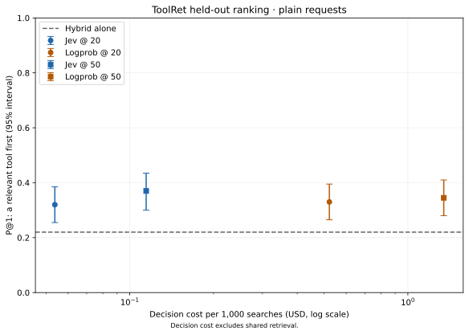
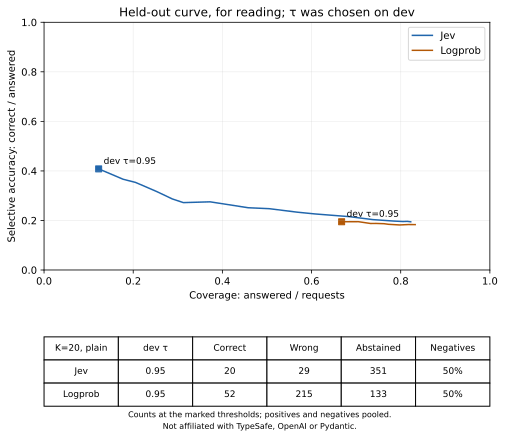

# ToolRet: does a decision stage improve tool retrieval?

A relevant tool appeared first on 22.0% of held-out requests with hybrid retrieval, 32.0%
with Jev and 33.0% with a GPT-4.1 mini logprob decision stage, at 20 candidates; GPT-6 Luna,
answering as structured output in a later run, reached 34.0%.
Later runs added Clef, Clef-flash, Strands Decider 2B, rizzo-flow and Laya, and asked GPT-6 Luna's searched
arm again ([Later deciders](#later-deciders)).
These are ranking measurements. Abstention changes which requests get a tool, and the observed
thresholds sacrifice many useful picks as well as preventing wrong ones.

This page reads the generated
[F2a summary](https://github.com/dfm88/toolhunch/blob/main/bench/results/2026-09-toolret-decision/summary.json)
and the [direct-choice summary](https://github.com/dfm88/toolhunch/blob/main/bench/results/2026-09-toolret-direct/summary.json),
alongside the benchmark implementation. It describes configuration performance, not end-to-end task success.

## Data and protocol

The catalog is `mteb/ToolRetrieval` at revision `76d45e560059754e289ea202462865a585679619`:
44,453 tools, catalog fingerprint
`sha256:7d56b70f34151288b0351d0764064e2d9852b9c2f1ef4e5ed076f1edb83debbf`.
The dev sample has 50 tasks; the separate held-out sample has 200. The main held-out run
is `20260929T153251Z`, recorded at toolhunch commit `57fd48a`, with Pydantic AI 2.50.0.

Hybrid retrieval fuses BM25 and `text-embedding-3-small` rankings with reciprocal rank fusion.
The decider receives either 20 or 50 candidates. The held-out Jev configuration uses BRIEF
card text, including only the description's first sentence; the logprob configuration uses FULL.
Parameter names are included. The planner can reduce detail when model limits require it.
This information difference limits any attribution of the result to the models alone.

The measured decision models are `jev-1.13.0@api.typesafe.ai`, with planner prompt version
`tool-choice-v1`, and `gpt-4.1-mini-2025-04-14@api.openai.com`, with
`tool-choice-v1+letters-v1`. Jev answers a choice question; the OpenAI adapter asks for one
option letter and ranks the probabilities returned in its token logprobs. The latter must split
larger choices into rounds to respect its declared option cap.

`plain` uses the task request as the query. `model` uses frozen queries written by
`gpt-5.4-mini-2026-03-17`; if the writer did not search, retrieval falls back to the original
request. That happened on 81 of the 200 held-out tasks. `model (searched)` reports the remaining
119 tasks separately. The headline tables below use `plain`.

Every positive has a paired negative formed by removing its labelled relevant tools from the
retrieval candidates. The pooled outcome tables therefore contain **200 positives and
200 negatives: 50% negatives**. A different, unlabelled tool might still serve a negative;
the test approximates “no suitable tool” rather than establishing it through tool execution.

Intervals are 95% percentile bootstrap intervals from 2,000 resamples, seed 0. The unit is a
task: its positive, negative and any repetitions are sampled together. The delta against hybrid
uses paired picks from the same tasks.

## Ranking a relevant tool first

P@1 considers positives and asks whether the first ranked card is a labelled relevant tool,
even when the decider abstains. The retrieval ceiling is the share of positives with any
relevant tool among the candidates. Several tools can be relevant to a request; choosing one
does not establish that it is the first executable step or that the task was completed.

| Candidates | Configuration | P@1 (95% CI) | Paired delta vs hybrid (95% CI) | Retrieval ceiling |
|---:|---|---:|---:|---:|
| 20 | Hybrid | 22.0% (16.5 to 27.5%) | — | 59.0% |
| 20 | Hybrid + Jev | 32.0% (25.5 to 38.5%) | +10.0 pp (4.0 to 15.5) | 59.0% |
| 20 | Hybrid + logprobs | 33.0% (26.5 to 39.5%) | +11.0 pp (5.0 to 17.0) | 59.0% |
| 50 | Hybrid | 22.0% (16.5 to 27.5%) | — | 71.5% |
| 50 | Hybrid + Jev | 37.0% (30.0 to 43.5%) | +15.0 pp (8.5 to 21.5) | 71.5% |
| 50 | Hybrid + logprobs | 34.5% (28.0 to 41.0%) | +12.5 pp (6.0 to 19.0) | 71.5% |



## Three readings of the same predictions

The following table uses **400 searches per row, split 50/50 positives and negatives**.
Correct means a labelled relevant tool was picked; wrong means a different tool was picked.
An abstention produces no tool pick and is shown separately.

“Answer always” ignores the reserved option and uses the top card of the existing ranking.
It is a free reinterpretation of a response generated with “none” available. It is not a
prediction of a forced-choice prompt. The dev ablation without “none” is a separate experiment;
for the logprob adapter it also changes the number of decision rounds.

With a “none” option, a tie between the best card and that option also abstains. With an
abstention threshold, the best card must additionally clear the threshold chosen on dev.

| K | Decider | Reading (50% negatives) | Correct | Wrong | Abstained | Coverage | Accuracy of picks | Wrong / searches (95% CI) |
|---:|---|---|---:|---:|---:|---:|---:|---:|
| 20 | Hybrid | Answer always | 44 | 356 | 0 | 100.0% | 11.0% | 89.0% (86.2 to 91.8%) |
| 20 | Jev | Answer always | 64 | 336 | 0 | 100.0% | 16.0% | 84.0% (80.8 to 87.2%) |
| 20 | Jev | With a “none” option | 64 | 265 | 71 | 82.2% | 19.5% | 66.2% (60.8 to 71.8%) |
| 20 | Jev | With an abstention threshold | 20 | 29 | 351 | 12.2% | 40.8% | 7.2% (4.2 to 10.5%) |
| 20 | Logprobs | Answer always | 66 | 334 | 0 | 100.0% | 16.5% | 83.5% (80.2 to 86.8%) |
| 20 | Logprobs | With a “none” option | 61 | 272 | 67 | 83.2% | 18.3% | 68.0% (62.5 to 73.5%) |
| 20 | Logprobs | With an abstention threshold | 52 | 215 | 133 | 66.8% | 19.5% | 53.8% (47.5 to 60.0%) |
| 50 | Hybrid | Answer always | 44 | 356 | 0 | 100.0% | 11.0% | 89.0% (86.2 to 91.8%) |
| 50 | Jev | Answer always | 74 | 326 | 0 | 100.0% | 18.5% | 81.5% (78.2 to 85.0%) |
| 50 | Jev | With a “none” option | 74 | 294 | 32 | 92.0% | 20.1% | 73.5% (68.8 to 78.0%) |
| 50 | Jev | With an abstention threshold | 21 | 20 | 359 | 10.2% | 51.2% | 5.0% (2.8 to 7.5%) |
| 50 | Logprobs | Answer always | 69 | 331 | 0 | 100.0% | 17.2% | 82.8% (79.5 to 86.0%) |
| 50 | Logprobs | With a “none” option | 68 | 298 | 34 | 91.5% | 18.6% | 74.5% (69.8 to 79.2%) |
| 50 | Logprobs | With an abstention threshold | 59 | 219 | 122 | 69.5% | 21.2% | 54.8% (49.0 to 60.8%) |

Coverage is picks divided by searches. Accuracy of picks is correct divided by all picks.
These pooled values depend on the artificial negative share, so they do not estimate production
reliability for an unspecified workload.

### Thresholds and stability

A threshold belongs to one model identity, prompt version, payload shape and question kind.
It cannot be carried to a different configuration as a general confidence cutoff. The dev
search considers the recorded threshold grid and maximises `(correct - wrong) / searches`,
with abstention worth zero; ties prefer the lower threshold. Dev runs with repeated searches
are excluded from threshold selection, and duplicated searches are deduplicated. Model-query
fallbacks still contribute to both query sources.

The held-out Jev and logprob rows above use dev thresholds of 0.95. No held-out key lacks a
dev threshold. The held-out coverage/accuracy curve is a diagnostic plot, not a place to tune:



For this curve the outcome mix is again **50% negatives**. The corresponding correct, wrong and
abstained counts for every threshold are in each summary row's `risk_coverage.grid`; the table
above includes all three counts for the deployed dev threshold.

The separate held-out repetition run bypasses local decision replay. Jev's P@1 is
30.5%, 31.0%, 30.5%; logprobs gives 32.0%, 32.5%, 33.0%, at 20 candidates on plain queries.
Probability variation means one deterministic-looking API setting does not ensure identical
probabilities or threshold outcomes between runs.

## Cost and latency

| K | Decider | Decision requests / search | Decision USD / 1,000 searches | Client decision p50 / p95 |
|---:|---|---:|---:|---:|
| 20 | Jev | 1 | $0.0538 | 253 / 312 ms |
| 20 | Logprobs | 2 | $0.5220 | 1,308 / 1,922 ms |
| 50 | Jev | 1 | $0.1145 | 264 / 343 ms |
| 50 | Logprobs | 4 | $1.3460 | 1,504 / 2,492 ms |

These are decision-stage costs for plain queries, pooled over positives and negatives, using
the price metadata of the run. Hybrid retrieval adds its own work: its recorded p50 / p95 is
782 / 1,023 ms. Embedding setup, query writing and downstream agent calls are excluded from
the table. A higher candidate count also changes the logprob planner's number of rounds.

The F2a local SQLite decision cache is a replay store. Replayed answers retain their original
usage and timing in this report, so per-search figures describe the original decisions;
they are not the actual spend or elapsed time of report regeneration. Retrieval timings were
measured with an embedding cache that could already contain query vectors. F2a does not measure
provider prompt-cache savings. The separate direct-choice experiment below measures single-turn
provider cache reads; multi-turn agent loops remain subsequent work.

## Direct choice on small catalogs

Should a selector search first, or read the whole catalog? This separate experiment compares
five strategies on identical requests within small catalogs from individual ToolRet sources.
Its [generated summary](https://github.com/dfm88/toolhunch/blob/main/bench/results/2026-09-toolret-direct/summary.json)
records run `20260930T050455Z-direct`, started on 2026-09-30 at commit `8f9cf16` with a clean
checkout and Pydantic AI 2.50.0. The dataset revision is the same as F2a; catalog fingerprints,
task identities, model limits and payload shapes are pinned in the manifest. The two GPT-6 Luna
arms come from a later run on the same requests, `20260930T170103Z-direct-luna`, started on
2026-09-30 at commit `67bb324` with the Luna changes not yet committed (they are in `4c98060`);
the summary lists it under `added_runs`.

### Protocol and applicability

The primary comparison uses four common catalogs in every strategy:

| Source | Tools | Positive requests | Negative requests |
|---|---:|---:|---:|
| `webtools_spotify` | 40 | 40 | 20 |
| `webtools_tmdb` | 54 | 54 | 27 |
| `tooleyes` | 95 | 95 | 48 |
| `apibank` | 101 | 101 | 50 |

There are **290 positives and 145 negatives: a 2:1 mix, 33.3% negatives** per strategy.
Positives contain all their labelled relevant tools in the catalog; no tasks were dropped.
Negatives are sampled with seed 0 and remove that request's labelled tools from its catalog.
Unlabelled alternatives might still be useful, so these are approximate negatives.

| Strategy | Selection mechanism | Tools available |
|---|---|---|
| `hybrid@20` | First hybrid retrieval result | Source catalog |
| `hybrid@20+jev` | Jev choice question, including “none” | Hybrid's 20 candidates |
| `jev-all` | Jev choice question, including “none” | Whole source catalog |
| `agent@20` | One GPT-4.1 mini function-tool request | Hybrid's 20 candidates |
| `agent-all` | One GPT-4.1 mini function-tool request | Whole source catalog |
| `agent-luna@20` | One GPT-6 Luna function-tool request, reasoning off | Hybrid's 20 candidates |
| `agent-luna-all` | One GPT-6 Luna function-tool request, reasoning off | Whole source catalog |

Hybrid uses the same BM25/embedding fusion as F2a. Jev is `jev-1.13.0@api.typesafe.ai`,
prompt `tool-choice-v1`; the agent is `gpt-4.1-mini-2025-04-14` through OpenAI Chat Completions,
prompt `direct-choice-v1`; the Luna arms send the same request to `gpt-6-luna` with
`reasoning_effort="none"`. Every selector receives the original name, complete description and
parameter names. All recorded selector requests used FULL detail; the planner needed no
reduction. Function definitions encode parameter names as string properties, and sanitised
function names map back to card IDs.

The agent makes one `pydantic_ai.direct.model_request`: text output is allowed,
`parallel_tool_calls=False`, temperature 0, a 256-token output cap and at most one retry.
The first function call is scored, without executing the tool. A response with no function call
counts as an abstention, including text other than literal `none`; all observed requests had no extra calls.
Jev uses the reserved “none” option without a fitted probability threshold. A picked relevant
tool is a success on a positive; abstentions and errors count as misses for every strategy.
Intervals and paired deltas use task-level bootstrap: 2,000 resamples, seed 0.

MetaTool (`metatool_which`, 200 tools) is separate. In the
[original pilot summary](https://github.com/dfm88/toolhunch/blob/main/bench/results/2026-09-toolret-direct/pilot/summary.json),
`agent-all` received HTTP 400 `array_above_max_length`, parameter `tools`, on **4/4 attempts**
with 200 function definitions. The exact provider maximum was not determined. That pair is
**not applicable**, rather than a selection failure; the four other strategies retain MetaTool.
`agent-luna-all` received the same rejection on 4/4 attempts in its pilot and is not applicable
there either.
The pilot's original `completed: false` and stop reason remain historical facts. Under the
recorded applicability restriction, the full run completed all 3,375 planned strategy requests
with zero errors; rejected pilot attempts remain in provenance and budget accounting.

### Primary results: the same four catalogs

These rates score **a relevant tool on 290 positive requests**. Several tools can be relevant;
the measurement does not establish task completion.

| Strategy | Relevant picks / positives (95% CI) | Paired delta vs hybrid (95% CI) |
|---|---:|---:|
| `hybrid@20` | 54.5% (48.6 to 60.0%) | — |
| `hybrid@20+jev` | 71.4% (65.9 to 76.6%) | +16.9 pp (10.7 to 23.1) |
| `jev-all` | 74.1% (69.0 to 79.0%) | +19.7 pp (13.8 to 25.9) |
| `agent@20` | 61.7% (55.9 to 66.9%) | +7.2 pp (0.0 to 14.5) |
| `agent-all` | 60.7% (55.2 to 66.2%) | +6.2 pp (−1.4 to 13.5) |
| `agent-luna@20` | 77.6% (72.4 to 82.1%) | +23.1 pp (17.6 to 29.0) |
| `agent-luna-all` | 79.7% (74.8 to 84.1%) | +25.2 pp (19.3 to 31.0) |

GPT-6 Luna had the highest observed rates; its arms ran later than the others, on the same
requests. Jev improved relevant picks relative to retrieval in this configuration. Reading the whole
catalog had the highest observed rate, but the delta intervals above compare each strategy
only with hybrid; they do not establish a difference between the two Jev strategies.

The following “none” outcomes use **435 requests per row: 290 positives and 145 negatives
(33.3% negatives)**. Correct and wrong count tool picks; abstentions count no pick.

| Strategy, 33.3% negatives | Correct | Wrong | Abstained | Coverage | Accuracy of picks | Wrong / requests (95% CI) |
|---|---:|---:|---:|---:|---:|---:|
| `hybrid@20` | 158 | 277 | 0 | 100.0% | 36.3% | 63.7% (59.7 to 67.7%) |
| `hybrid@20+jev` | 207 | 122 | 106 | 75.6% | 62.9% | 28.0% (23.9 to 32.7%) |
| `jev-all` | 215 | 121 | 99 | 77.2% | 64.0% | 27.8% (23.9 to 32.4%) |
| `agent@20` | 179 | 145 | 111 | 74.5% | 55.2% | 33.3% (29.1 to 37.5%) |
| `agent-all` | 176 | 120 | 139 | 68.0% | 59.5% | 27.6% (23.4 to 31.6%) |
| `agent-luna@20` | 225 | 210 | 0 | 100.0% | 51.7% | 48.3% (44.5 to 52.0%) |
| `agent-luna-all` | 231 | 204 | 0 | 100.0% | 53.1% | 46.9% (43.2 to 50.6%) |

GPT-6 Luna never answered without a function call: it picked a tool for every negative.
No direct-choice abstention threshold was tuned. The summary also includes Jev's ranking with
“none” ignored as a diagnostic; that is separate from the symmetric headline above. Coverage,
accuracy of picks and abstention metrics depend on this artificial negative mix.

### MetaTool and secondary results

MetaTool alone has **200 positives and 100 negatives (33.3% negatives)** per applicable strategy:

| Strategy, MetaTool only, 33.3% negatives | Relevant picks / positives (95% CI) | Correct | Wrong | Abstained |
|---|---:|---:|---:|---:|
| `hybrid@20` | 49.5% (43.0 to 56.0%) | 99 | 201 | 0 |
| `hybrid@20+jev` | 65.5% (59.0 to 72.0%) | 131 | 103 | 66 |
| `jev-all` | 72.0% (65.5 to 78.0%) | 144 | 149 | 7 |
| `agent@20` | 60.0% (53.0 to 66.5%) | 120 | 113 | 67 |
| `agent-all` | n/a | n/a | n/a | n/a |
| `agent-luna@20` | 65.5% (59.0 to 72.0%) | 131 | 168 | 1 |
| `agent-luna-all` | n/a | n/a | n/a | n/a |

The secondary `all_catalogs` pool combines all five sources for the strategies applicable everywhere:
**490 positives and 245 negatives (33.3% negatives)**. It is not a five-strategy comparison.

| Strategy, secondary all-catalog pool, 33.3% negatives | Relevant picks / positives (95% CI) | Correct | Wrong | Abstained |
|---|---:|---:|---:|---:|
| `hybrid@20` | 52.4% (48.0 to 56.7%) | 257 | 478 | 0 |
| `hybrid@20+jev` | 69.0% (64.5 to 72.9%) | 338 | 225 | 172 |
| `jev-all` | 73.3% (69.2 to 77.1%) | 359 | 270 | 106 |
| `agent@20` | 61.0% (56.7 to 65.3%) | 299 | 258 | 178 |
| `agent-luna@20` | 72.7% (68.8 to 76.3%) | 356 | 378 | 1 |

Per-source selection intervals and all cost rows are in the generated summary.
These rates cannot be compared with F2a's headline as an effect of the model or catalog size:
F2a searched 44,453 tools on a different 200-task held-out sample and used BRIEF Jev cards.
The direct test uses source-specific catalogs, a different request population and aligned FULL text.

### Single-turn cache reads, cost and latency

The run processes catalogs sequentially, then each strategy's positives before its negatives,
with concurrency 1. Agent requests use the catalog source as `openai_prompt_cache_key`;
this affects routing and does not guarantee a cache hit. Positives keep the full catalog fixed
for `agent-all`, while `agent@20` changes its retrieved tools with the request. Negatives remove
different tools and are priced separately.

The following costs use **newly observed calls in the full run**, excluding local SQLite
replays. Warm means positive requests after the first scored positive of each catalog, not a
guaranteed cache hit. Cache share is cached input tokens divided by input tokens, not the
fraction of requests with a hit. Billed cost uses reported cache reads at the recorded cached
rate; list cost prices the same observed tokens without a cache discount. These are calculated
usage costs, not invoice verification.

| Strategy, four common catalogs | Observed warm positives | Warm billed / 1,000 | Warm list / 1,000 | Warm cache share | Warm latency p50 / p95 | Negative billed / 1,000 |
|---|---:|---:|---:|---:|---:|---:|
| `hybrid@20` | 286 | $0.000250 | $0.000250 | n/a | 160 / 253 ms | $0.0000 |
| `hybrid@20+jev` | 250 | $0.0828 | $0.0828 | n/a (unmeasured) | 449 / 631 ms | $0.0833 |
| `jev-all` | 250 | $0.2807 | $0.2807 | n/a (unmeasured) | 323 / 439 ms | $0.2752 |
| `agent@20` | 250 | $0.6804 | $0.6804 | 0.0% | 936 / 2,000 ms | $0.6934 |
| `agent-all` | 250 | $0.7856 | $2.4286 | 92.1% | 861 / 1,932 ms | $1.6857 |
| `agent-luna@20` | 250 | $0.1800 | $0.1800 | 0.0% | 1,237 / 2,698 ms | $0.1814 |
| `agent-luna-all` | 250 | $0.0746 | $0.6153 | 99.6% | 1,452 / 2,410 ms | $0.4490 |

The observed negative denominators are 145, 117, 125, 118, 125, 118 and 125 respectively;
replays account for the remaining requests. Search cost and latency are included for strategies
that search first, with physical searches shared and paid once. Retrieval used an existing
embedding cache: the near-zero incremental embedding cost is not a fresh-index price, and
corpus preparation, previously cached embeddings and downstream tool execution are excluded.
Replays still contribute their selections to the outcome tables, but no historical tokens,
cache reads or latency to these cost measurements.

Provider cache reads for Jev were not measured; n/a does not mean zero. The observed agent
warm-positive cache shares vary by catalog:

| Source | `agent@20` | `agent-all` | `agent-luna@20` | `agent-luna-all` |
|---|---:|---:|---:|---:|
| `webtools_spotify` | 0.0% | 86.4% | 0.0% | 99.3% |
| `webtools_tmdb` | 0.0% | 88.9% | 0.0% | 99.6% |
| `tooleyes` | 0.0% | 91.8% | 0.0% | 99.5% |
| `apibank` | 0.0% | 93.8% | 0.0% | 99.7% |

The first scored positive of each catalog defines the report's cold phase. In the full run,
all Jev and agent cold responses were replays, so **no new selector cold measurement exists**.
For reference, the following cold costs come exclusively from the original pilot, one first
positive for each of the four common catalogs; “cold” does not establish an empty provider cache.

| Strategy | Pilot cold observations | Pilot cold billed total | Pilot cold billed / 1,000 |
|---|---:|---:|---:|
| `hybrid@20` | 4 | $0.000000820 | $0.000205 |
| `hybrid@20+jev` | 4 | $0.000310654 | $0.0777 |
| `jev-all` | 4 | $0.000966420 | $0.2416 |
| `agent@20` | 4 | $0.002499220 | $0.6248 |
| `agent-all` | 4 | $0.008329600 | $2.0824 |

On this run, `agent-all` read many cached tokens and its observed warm billed cost was below
list cost. It still cost more than `agent@20` per newly measured positive. With Luna the order
reverses: nearly every input token of `agent-luna-all` was a cache read, and it cost less than
`agent-luna@20` and than `jev-all`, at more than four times Jev's median latency. The Luna pilot's
first positives were replayed in the full run, so the Luna arms have no new cold measurement either. This is a comparison
of strategies, not an isolated causal estimate of caching's effect on latency: tool counts,
content and routing also differ. These are single-turn requests on one provider; multi-turn
agent loops remain future work.

### Run spending and reproduction

The full run records **$1.009410520** in verified reported provider usage; the pilot records
**$0.136456578**, giving **$1.145867098** cumulatively. Four rejected pilot attempts have unknown
billed usage, with a **$0.170782800** conservative budget reserve, not a measured charge.
Including that reserve, the recorded P1 budget total is **$1.316649898**, below the $7 cap
(a dollar counted as a euro for the guard). These physical provider totals differ from per-strategy
costs, which attribute shared search work to each strategy and exclude replay usage.
The regenerated pilot report projects **$1.048989796** in remaining usage and **$1.356229174**
in cumulative P1 spending, including its historical prior and all guarded charges. It uses only
applicable, priced warm-positive and negative samples; the excluded rejections retain their
unknown billing and budget reserves. This is an observed projection, not a guaranteed upper bound:
future cache routing and output lengths can change. The separate recorded uncached/max-output
reference is **$4.601294792** for the original full workload, including the subsequently excluded pair
and without subtracting covered requests, or **$4.908534170** including the pilot's guarded charges.
That historical estimate is also approximate;
the independent guard reserves each physical call before it runs. Report regeneration authorizes
no new execution and preserves the pilot's original incomplete status.

Regenerate either report from local raw runs without provider calls:

```shell
uv run toolhunch-bench direct-report bench/runs/20260929T221520Z-direct-pilot \
  --out bench/results/2026-09-toolret-direct/pilot/
uv run toolhunch-bench direct-report bench/runs/20260930T050455Z-direct \
  --add bench/runs/20260930T170103Z-direct-luna --out bench/results/2026-09-toolret-direct/
```

The Luna arms run on their own with `uv run toolhunch-bench direct --luna` (`--pilot`, `--dry-run`
as above); their full run recorded $0.170 of verified usage, the pilot $0.070.

Raw runs and replay stores are git-ignored. A fresh paid reproduction requires credentials and
the pinned dataset. Start with `uv run toolhunch-bench direct --dry-run`, then
`uv run toolhunch-bench direct --pilot`; inspect validity, cache fields and spending before
running `uv run toolhunch-bench direct`. The recorded non-applicable pair is skipped.
Every paid run prints an estimate first, appends to the cost ledger and applies the P1 spend guard.
Future direct dry estimates expose missing-dense retrieval fallbacks. If a BM25 stand-in has fewer
than 20 matches, they budget the longest applicable FULL cards up to `min(20, catalog size)`,
separately by Jev's heuristic text size and the agent's function-schema token size; Jev's planner
still applies the declared limits and may reduce detail. Cached hybrid candidates stay unchanged.
Other lexical stand-ins and token framing remain approximate. The historical manifest's
`stand_in_searches=0` is preserved as provenance, but its diagnostic counter was hidden by a wrapper
and does not prove that every embedding was cached.

## Candidate-order sensitivity

Both measured F2a configurations changed their first-ranked tool more often across candidate
orders than in a historical fixed-order repetition run. This does not isolate a causal effect
of order: the fixed-order comparison comes from another execution, and run conditions can differ.
The [generated order summary](https://github.com/dfm88/toolhunch/blob/main/bench/results/2026-09-toolret-order/summary.json)
contains all results, the matched noise baseline and provenance.

### Method and ranking results

Run `20260930T072339Z-order`, started on 2026-09-30 at clean commit `d4ee71a`, uses the same
200 held-out tasks, catalog and `plain` queries as F2a, at K=20. It retains Jev
`jev-1.13.0@api.typesafe.ai` at BRIEF detail, prompt `tool-choice-v1`, and
`gpt-4.1-mini-2025-04-14@api.openai.com` logprobs at FULL, prompt
`tool-choice-v1+letters-v1`. Neither configuration needed detail lowering.

Order 0 is retrieval order; orders 1–4 shuffle the same candidates with seeds derived from
SHA256 of task ID and order index. The reserved option stays last in the final choice question.
All five orders make fresh decisions, bypassing local SQLite replay. The manifest records
scheduling; physical provider requests are serialised, with no automatic retry. The exchanges
record the actual option-key-to-card-ID mapping and presentation order for each round.
All 4,000 logical decisions completed without errors or excluded groups, after a first-ten-task pilot.

P@1 here is **a relevant tool ranked first on 200 positives, with abstention ignored**.
It measures ranking rather than completed tasks. Intervals are 95% task-cluster bootstrap
intervals, 2,000 resamples, seed 0.

| Configuration | Identity P@1 (95% CI) | Shuffle mean (95% CI) | Shuffle minimum (95% CI) | Shuffle maximum (95% CI) |
|---|---:|---:|---:|---:|
| Jev, BRIEF | 30.5% (24.0 to 37.0%) | 31.2% (25.1 to 37.1%) | 30.5% (23.5 to 35.5%) | 32.5% (26.5 to 39.5%) |
| Logprobs, FULL | 33.0% (26.5 to 39.5%) | 29.0% (23.4 to 34.6%) | 27.0% (21.0 to 32.5%) | 30.5% (25.5 to 37.5%) |

The individual shuffle P@1 values, in seed order 1–4, are 30.5%, 31.0%, 31.0%, 32.5% for Jev
and 29.5%, 29.0%, 30.5%, 27.0% for logprobs; each interval is in the summary. Jev's aggregate
ranking rate changed little across these orders, even though many first-card identities changed.
All four logprob shuffles had a lower observed rate than identity in this run. The result covers
only this date, K=20, plain queries and these configurations, whose card detail differs.

Minimum and maximum refer to population P@1 across the four shuffles, not to each task's best
or worst answer. Their bootstrap intervals resample tasks before taking the extremum. Selecting
a maximum from noisy estimates can push it upward, and selecting a minimum can push it downward;
the range is not a guaranteed gain or loss attributable to order.

### Stability compared with fixed-order noise

Pairwise agreement is the mean fraction of pairs that rank the same card first on the same
positive task. The historical baseline is run `20260929T162701Z`, with three fresh fixed-order
repeats on the same 200 positives. The generated comparison checks model, prompt, limits,
detail, task, query and identity candidate/payload matches. Its original manifest records
commit `57fd48a`, `dirty: true`; the summary preserves that status and hashes of the reference
manifest and records. This is observed run noise, not a reconstruction of a clean historical checkout.

| Configuration | Fixed-order pairwise agreement, three repeats (95% CI) | Five-order pairwise agreement (95% CI) | Same top card in all five orders (95% CI) |
|---|---:|---:|---:|
| Jev, BRIEF | 96.0% (93.7 to 98.0%) | 76.5% (72.3 to 80.4%) | 57.5% (50.5 to 64.0%) |
| Logprobs, FULL | 98.0% (96.3 to 99.3%) | 60.5% (55.6 to 65.1%) | 39.0% (32.5 to 45.5%) |

Compare the pairwise columns, rather than “all three repeats agree” with “all five orders agree”:
the latter are different statistics because their number of observations differs. Lower observed
agreement across orders is a sensitivity signal beyond the recorded fixed-order variation,
but this cross-run comparison is observational, not a causal test or a significance test of
the difference. Dates, scheduling and software versions can differ.

The fixed-order baseline's population P@1 extrema are:

| Configuration | Three-repeat minimum (95% CI) | Three-repeat maximum (95% CI) |
|---|---:|---:|
| Jev, BRIEF | 30.5% (23.5 to 36.0%) | 31.0% (25.0 to 37.5%) |
| Logprobs, FULL | 32.0% (25.5 to 38.5%) | 33.0% (26.5 to 39.5%) |

Identity also gives a run-drift check against the published main F2a run `20260929T153251Z`.
The report applies the same publication normalisation to the reference manifest, retains its
fields, and requires exact configuration, task, candidate and payload matches plus reproduction
of published P@1. The resulting identity-minus-published delta is −1.5 pp (−3.0 to 0.0) for Jev
and 0.0 pp (−1.5 to 1.5) for logprobs. These are paired 95% intervals and a date/run diagnostic;
neither delta is attributed to order or to a causal effect of the day.

### Position and abstention diagnostics

Among the four shuffles of 200 positives, there are 800 first-card positions per configuration.
The position is the **outer presented candidate slot**, with the reserved option ignored, not
the letter or slot in a later logprob finalist question.

| Configuration | Slot 1 (95% CI), uniform reference 5% | Slots 1–3 (95% CI), uniform reference 15% | Descriptive chi-square |
|---|---:|---:|---:|
| Jev, BRIEF | 7.2% (5.2 to 9.4%) | 18.2% (15.5 to 21.1%) | 29.7 |
| Logprobs, FULL | 8.6% (6.6 to 10.9%) | 23.2% (20.0 to 26.5%) | 72.8 |

The complete 20-slot distributions and a separate 50/50-mix diagnostic are in the summary.
The chi-square has 19 degrees of freedom and no p-value: repeated task observations are
correlated, so it is descriptive, without a causal uniform-position conclusion.

The “none” outcomes below use **400 requests per order and configuration: 200 positives and
200 gold-removed negatives (50% negatives)**. No new threshold was fitted. Correct/wrong count
tool picks and abstained counts no pick; unlabelled alternatives can still serve a negative.

| Configuration, 50% negatives | Order | Correct | Wrong | Abstained |
|---|---|---:|---:|---:|
| Jev, BRIEF | Identity | 61 | 268 | 71 |
| Jev, BRIEF | Shuffle 1 | 61 | 271 | 68 |
| Jev, BRIEF | Shuffle 2 | 61 | 264 | 75 |
| Jev, BRIEF | Shuffle 3 | 62 | 267 | 71 |
| Jev, BRIEF | Shuffle 4 | 65 | 262 | 73 |
| Logprobs, FULL | Identity | 61 | 272 | 67 |
| Logprobs, FULL | Shuffle 1 | 54 | 279 | 67 |
| Logprobs, FULL | Shuffle 2 | 56 | 278 | 66 |
| Logprobs, FULL | Shuffle 3 | 56 | 272 | 72 |
| Logprobs, FULL | Shuffle 4 | 51 | 285 | 64 |

On this **50% negative mix**, the answer/abstain decision was unchanged across all five orders
on 93.0% (89.7 to 96.0%) of Jev searches and 83.0% (78.0 to 87.8%) of logprob searches.
The counts immediately above show the corresponding correct, wrong and abstained outcomes
for each order; this stability does not establish answer correctness.

### Averaging five decisions and its cost

Averaging is a free offline rereading of the five recorded responses. It averages each card's
final probability, assigns zero to cards eliminated before a logprob final round, and breaks
ties in identity order. Logprob finalist sets can differ between orders: this is a heuristic
combination of final distributions, not a complete common distribution over all 20 candidates.

| Configuration | Averaged ranking P@1 (95% CI) | Correct / wrong / abstained, 200 positive + 200 negative (50% negatives) | Production decisions / search | Physical provider requests / search | Decision USD / 1,000 searches |
|---|---:|---:|---:|---:|---:|
| Jev, BRIEF | 31.5% (25.0 to 37.5%) | 63 / 263 / 74 | 5 | 5 | $0.2689 |
| Logprobs, FULL | 31.0% (25.0 to 37.0%) | 58 / 271 / 71 | 5 | 10 | $2.5373 |

The averaged ranking did not show a large observed gain over identity here; for logprobs it
was below identity. It is not a free production improvement: those costs include all five
decisions and the logprob adapter's two rounds per decision, pooled over the stated 50/50 mix.
They exclude retrieval, existing embedding preparation and downstream agent/tool execution.

Reported provider usage cost for the full order run is $1.122489730: Jev $0.107552130 and
logprobs $1.014937600, with no new failed-attempt reserve. Adding the manifest's previous
P1 guarded charge gives $2.486487488 through this run, including the earlier direct pilot's
unknown-billing reserve. Usage-based costs are not invoice verification. Calls were never
locally replayed; reported provider cache reads can still affect billing. Jev's provider
cache usage remains unmeasured.

Regenerate this report from existing local raw runs without provider calls:

```shell
uv run toolhunch-bench order-report bench/runs/20260930T072339Z-order \
  --noise-reference-run bench/runs/20260929T162701Z \
  --out bench/results/2026-09-toolret-order/
```

A new run uses the F2a `decision` command with `--order-sensitivity`, held-out tasks,
`--deciders jev,logprob --k 20 --sources plain` and Jev BRIEF/logprob FULL. Start with
`--dry-run`, then `--pilot`; the full requires `--pilot-run` naming the validated pilot.
The runner prints estimates, charges `P1: order sensitivity` in the ledger and enforces the
cumulative P1 guard. The paid run stops on an error; it is not automatically relaunched.

## GPT-6 Luna as a structured-output decider

GPT-6 Luna (`gpt-6-luna`, reasoning off) returns at most 5 top logprobs, and only with
`reasoning_effort="none"`: too few for the logprob decider, which reads 20 option letters. It
answers the same letter prompt instead as one letter from a JSON-schema enum
(`tool-choice-v1+letters-v1-json-v1`, 16 completion tokens at most). The answer has no
probabilities: the chosen card gets 1 and the others 0, so there is no threshold reading, no
averaging over orders, and a pick behind “none” is unknown. The
[generated Luna summary](https://github.com/dfm88/toolhunch/blob/main/bench/results/2026-09-toolret-luna/summary.json)
combines three runs on the F2a held-out tasks, catalog and `plain` queries at K=20, on 2026-09-30:

| Run | Protocol | Used for |
|---|---|---|
| `20260930T171259Z` | forced pick (no “none” option), five orders, cache bypassed | first pick (order 0) and order |
| `20260930T170022Z` | reserved “none” option, positives and gold-removed negatives | “none” reading |
| `20260930T170024Z` | forced pick, retrieval order, three repeats, cache bypassed | same-order noise |

| First pick (95% CI) | Δ vs hybrid (95% CI) | Decision $ / 1,000 | Latency p50 / p95 |
|---:|---:|---:|---:|
| 34.0% (27.0 to 40.5%) | +12.0 pp (6.5 to 17.5) | $0.12 | 1,058 / 1,982 ms |

With “none” allowed, on 200 positives and 200 negatives, Luna gave 60 correct, 257 wrong and
83 “none” answers (Jev 64/265/71, GPT-4.1 mini logprobs 61/272/67). It said “none” to 16% of
positives and 25.5% of negatives.

Across the five orders of 198 tasks, two orders agreed on the first tool 62.9% (58.4 to 67.4%) of
the time, against 92.1% (88.9 to 95.1%) over three same-order repeats on 199 tasks. P@1 went from
34.3% in retrieval order to 33.8%, 31.3%, 32.8% and 33.8% in the four shuffles (mean 33.0%, 27.1 to
38.9%). One of the first three presented slots was picked 23.1% of the time; a uniform pick gives 15%.
Luna returned no content, with an empty refusal and `finish_reason` `stop`, on 3 of 1,000 order asks
(2 tasks) and 1 of 600 repeats; one of them reproduced on a direct retry. Those searches are
counted as errors and their tasks left out of the order and noise comparisons.

## Later deciders

Two later rounds put five more deciders through the same three tests, on the same tasks, catalogs and
retrieval, each at the configuration its dev runs chose under a fixed rule (the higher P@1 at K20 on `plain`;
a tie goes to the configuration the model ships with). Every number below is copied from the generated
summaries: re-ranking in [decision P2](https://github.com/dfm88/toolhunch/blob/main/bench/results/2026-10-toolret-decision-p2/summary.json) and
[decision P3](https://github.com/dfm88/toolhunch/blob/main/bench/results/2026-10-toolret-decision-p3/summary.json), direct choice in
[direct P3](https://github.com/dfm88/toolhunch/blob/main/bench/results/2026-10-toolret-direct-p3/summary.json), which holds every arm so far, and candidate order in
`bench/results/2026-10-toolret-order-p2/` and `bench/results/2026-10-toolret-order-p3/`.

| Decider | Where it ran | Configuration |
|---|---|---|
| Clef, Clef-flash | Cloudflare Workers AI, 2026-10-04; no pinned version (API version `2026-10-01.epoch` at the probe) | BRIEF cards |
| Strands Decider 2B | `strands-decider-2B-hobson-v19` on MLX, one Mac, 2026-10-04 | FULL cards |
| rizzo-flow | `rizzoaiacademy/rizzo-flow` 4B q8_0 at source `b9ba007`, llama.cpp `b11081` (Metal), one Mac, 2026-10-05 | FULL cards |
| Laya wide | laya 0.3.27, English checkpoint `55cf4c4`, PyTorch on MPS, one Mac, 2026-10-05 | 512-token question and 1,024-token sequence budgets, BRIEF cards and a BRIEF floor |

The Mac is an Apple M5 Max with 128 GB under macOS 26.6.2; local runs have no money cost, and their latency is
that machine's. rizzo-flow and Laya answer one request at a time, so their latency adds every call of a search.

### Re-ranking 44,453 tools

Held-out, `plain` queries, hybrid alone 22.0% (ceilings 59% at K=20 and 71.5% at K=50):

| Decider | P@1 K=20 (95% CI) | Δ vs hybrid K=20 (95% CI) | P@1 K=50 | $ / 1,000 searches K=20 | Decision p50 K=20 |
|---|---:|---:|---:|---:|---:|
| Clef | 31.0% (24.5 to 37.0) | +9.0 pp (+3.5 to +14.5) | 36.5% | $0.27 | 517 ms |
| rizzo-flow | 30.5% (24.0 to 36.5) | +8.5 pp (+4.0 to +13.0) | 33.5% | local | 434 ms |
| Strands Decider 2B | 28.5% (22.5 to 34.5) | +6.5 pp (+0.5 to +12.5) | 28.0% | local | 81 ms |
| Clef-flash | 24.0% (18.0 to 30.0) | +2.0 pp (−4.0 to +7.5) | 28.0% | $0.10 | 341 ms |
| Laya wide | 20.0% (15.0 to 25.5) | −2.0 pp (−9.0 to +4.0) | 17.8% | local | 104 ms |

Clef and rizzo-flow join Jev (32.0%), GPT-4.1 mini logprobs (33.0%) and GPT-6 Luna (34.0%) within the
intervals. Laya wide's dev P@1 (28.0% on 50 tasks) did not hold. Every later decider gave identical
probabilities when a dev search was repeated three times, so none has held-out repeats. The dev thresholds
(0.90 to 0.95) leave them little coverage: at τ = 0.95 Clef answers 12 of 400 held-out requests and
rizzo-flow 52 (selective accuracy 42.3%).

### Direct choice on the same four catalogs

Pooled over the 290 positives and 145 negatives of the primary population; warm requests, decision latency
alone:

| Arm | Relevant picks (95% CI) | Δ vs hybrid (95% CI) | Negatives answered “none” | $ / 1,000 | Decision p50 |
|---|---:|---:|---:|---:|---:|
| clef-all | 79.7% (75.2 to 84.1) | +25.2 pp (+19.7 to +31.0) | 26% | $1.63 | 1,428 ms |
| clef-flash-all | 78.6% (73.8 to 83.1) | +24.1 pp (+18.6 to +30.0) | 16% | $0.61 | 685 ms |
| hybrid@20+clef | 76.9% (72.1 to 81.7) | +22.4 pp (+16.6 to +28.3) | 31% | $0.44 | 612 ms |
| hybrid@20+clef-flash | 76.9% (72.1 to 81.7) | +22.4 pp (+16.9 to +28.3) | 25% | $0.17 | 463 ms |
| hybrid@20+rizzo-flow | 69.7% (64.5 to 74.5) | +15.2 pp (+9.3 to +21.0) | 29% | local | 573 ms |
| rizzo-flow-all | 69.0% (63.4 to 74.1) | +14.5 pp (+9.0 to +20.3) | 28% | local | 2,945 ms |
| strands-all | 62.1% (56.2 to 67.6) | +7.6 pp (+1.4 to +13.4) | 26% | local | 116 ms |
| hybrid@20+strands | 61.4% (55.9 to 66.9) | +6.9 pp (+1.4 to +13.1) | 37% | local | 157 ms |
| hybrid@20+laya-wide | 40.7% (34.8 to 46.2) | −13.8 pp (−19.7 to −7.9) | 58% | local | 108 ms |
| laya-wide-all | 34.8% (29.3 to 40.3) | −19.7 pp (−25.5 to −13.8) | 43% | local | 303 ms |

Search alone picks 54.5%; Jev 74.1% (whole catalog) and 71.4% (20 searched tools); the GPT-6 Luna agent 79.7%
and 77.6%. rizzo-flow's whole-catalog arm asks about six questions a request, one at a time. Strands Decider 2B
fit its 4,096-token window by lowering card detail on 375 whole-catalog requests. Laya wide says “none” to
37–40% of the requests that do have a relevant tool.

**GPT-6 Luna asked again.** `agent-luna@20` ran again on 2026-10-05 with query embeddings computed fresh, as
every other searching arm's were, and replaces the earlier run's arm in the
[P1](https://github.com/dfm88/toolhunch/blob/main/bench/results/2026-09-toolret-direct/summary.json) and
[P2](https://github.com/dfm88/toolhunch/blob/main/bench/results/2026-10-toolret-direct-p2/summary.json) direct summaries. Its pooled
pick rate is the same, 77.6% (72.4 to 82.1); the median request, search included, is now 1,465 ms against the
earlier run's 1,237 ms, whose search was served from cached embeddings.

### Candidate order

Held-out, K=20, `plain`, identity order and four task-seeded shuffles:

| Decider | Identity P@1 | Shuffle mean | Five-order top-card stability | Pairwise agreement (95% CI) |
|---|---:|---:|---:|---:|
| Clef | 31.0% | 30.9% | 96.5% | 98.5% (97.3 to 99.6) |
| Clef-flash | 24.0% | 23.9% | 96.0% | 98.0% (96.5 to 99.3) |
| Laya wide | 20.0% | 18.6% | 26.0% | 52.2% (47.7 to 56.7) |
| Strands Decider 2B | 28.5% | 27.6% | 24.0% | 50.2% (46.0 to 54.6) |
| rizzo-flow | 30.5% | 26.5% | 24.0% | 46.9% (42.1 to 51.6) |

Clef and Clef-flash barely move when the candidates are shuffled; the three models run on the Mac change their
top card more often than any hosted model measured (Jev 76.5%, GPT-6 Luna 62.9%, GPT-4.1 mini 60.5%).
rizzo-flow does best in search order.

### Limits of the later runs

- **Laya wide** is a configuration of ours: the English checkpoint ships 192-token question and 512-token
  sequence budgets, which hold no 50-candidate list and not every 20-candidate one. Its options are capped at
  48 tokens: 25–28% of the held-out options were shown by name only, because their BRIEF text was over the cap
  (5–41% by catalog in direct choice), and 1.6–2.1% by their key alone; 10 of 1,600 held-out searches failed on
  a tool whose key alone is over the cap, and are left out of P@1. Reading the whole catalog, one MetaTool list
  of 198 tools did not fit two rounds, so `laya-wide-all` is not applicable there. The checkpoint ships an
  uncalibrated temperature for questions of 11 or more options: 798 of the 1,590 held-out searches it was asked
  held one. Its authors present the base checkpoints as a base to specialise; we ran it zero-shot.
- **rizzo-flow** refuses an option over 8,000 characters, its key and text together. One held-out tool of about
  9,700 characters is shown at BRIEF alone (4 options of 40,000); its seconds per 1,000 input tokens varied
  between 0.30 and 0.79 across runs on the same machine.
- **Strands Decider 2B** lowered card detail to fit its window on 375 whole-catalog requests and 161 of 400 K=50
  `plain` searches.
- **Clef and Clef-flash** have no pinned version; Cloudflare may change them under the same name.

## Compatible-server smoke tests

Smoke-tested on 2026-09-30 with laya-serve 0.3.22 and rizzo-flow 0.1.0 on a two-tool example; benchmarked
later at newer versions ([Later deciders](#later-deciders)).
The [generated smoke summary](https://github.com/dfm88/toolhunch/blob/main/bench/results/2026-09-jev-compatible-smoke/summary.json)
records accepted requests, parsed answers and `get_weather` ranked first for both servers,
without sending an Authorization header. The question was “What's the weather in Milan?”,
with weather and e-mail cards plus reserved “none”. No tool was executed. These are protocol
smoke tests, with no catalog accuracy, latency or task-completion claim.

| Server package and source | Tested model | Backend and checkpoint |
|---|---|---|
| laya 0.3.22, source `6d942c9` | `english`: `convaiinnovations/laya` | English revision `55cf4c4`, PyTorch/mps, no quantisation requested |
| rizzo-flow 0.1.0, source `b9ba007` | `rizzo-latest`: `rizzoaiacademy/rizzo-flow` | Revision `55633c8`, `spark-x2.5-4b-rizzo-flow-lora-q4_k_m.gguf`, llama.cpp/mtl release `b11081`, prompt `spark-decisions-v3` |

Limits are declared instance data, with sources checked on **2026-09-30**:

| Configuration | State + question token budget | Options including “none” | Questions / request | Source |
|---|---:|---:|---:|---|
| Laya English | 512 | 100 HTTP cap | 64 | [Pinned model config](https://huggingface.co/convaiinnovations/laya/resolve/55cf4c4ebb4ebe31b2550e8bdf3bd21b99753851/rl_agent_config.json), [server code](https://github.com/NandhaKishorM/laya/blob/6d942c92081fbc139e736bbd9ac0023223c29b7f/laya/serve.py) |
| rizzo-flow, tested context | 8,192 | 26 | 64 | [Pinned source](https://github.com/Rizzo-AI-Academy/rizzo-flow/tree/b9ba007ee4d2928bbab5b1d8bfe9009c3696b6de/src/rizzo_flow): `cli.py --ctx=8192`, `schema.py MAX_SLOTS=26`, `compat.py` |

Laya's HTTP option cap does not mean 100 options fit its token window. Toolhunch uses a
heuristic token estimate while planning; each server adds its own template and tokenizer.
The small successful example establishes neither large-catalog support nor planner behaviour
under these windows. Other model revisions, endpoints, question kinds and environments were
not covered by the smoke tests.

The [README example](https://github.com/dfm88/toolhunch/blob/main/examples/jev_compatible_server.py)
uses unchanged `JevWireModel(base_url=..., api_key_env=None, limits=...)` and `ChoiceDecider`.
Its offline tests use `httpx2.MockTransport` to check the POST endpoint, absence of auth,
declared limits and weather selection; a separate opt-in live test skips unless a loopback
server URL is configured. The default suite sends no network requests. The published
summary is inspectable without starting a server; regenerating the smoke artifact requires
the recorded private raw evidence and audit metadata.

## Limits of the experiment

- Task labels establish relevant tools, not successful tool execution or complete agent tasks.
- Gold-removed negatives can leave unlabelled alternatives that would still be useful.
- The dev sample is small, and configuration-specific probabilities can vary across repeats.
- Jev and logprob card detail differs in F2a. The separate direct-choice comparison aligns full card text.
- The GPT-6 Luna runs came after the others, on 2026-09-30, on the same tasks; a structured answer carries no
  probabilities, so its readings are fewer.
- Cost and latency are tied to the models, routing, caching state and date of these runs; local models' latency
  is one machine's.
- The later deciders' limits are listed under [Limits of the later runs](#limits-of-the-later-runs).
- Searches that raised `DecisionError` are excluded from rates, latency and costs; the published dev and
  main held-out configurations reported no errors.

## Reproduce

Install the workspace with `uv sync --all-packages`. Keep API credentials in your environment or
local `.env`; the benchmark loads them in code. No keys are needed to regenerate reports from
existing local run directories:

```shell
uv run toolhunch-bench decision-report \
  --dev bench/runs/20260929T140534Z --dev bench/runs/20260929T144900Z --dev bench/runs/20260929T145416Z \
  --dev bench/runs/20260929T145809Z --dev bench/runs/20260929T150417Z \
  --heldout bench/runs/20260929T153251Z --heldout-repeats bench/runs/20260929T162701Z \
  --out bench/results/2026-09-toolret-decision/
uv run toolhunch-bench decision-charts bench/results/2026-09-toolret-decision/summary.json --out docs/assets
```

The later summaries regenerate the same way: each lists its runs in `manifest`, `runs` or `added_runs`, and
`uv run toolhunch-bench readme-charts` redraws the README figures from every published summary.

The Luna summary regenerates from its three runs with
`uv run toolhunch-bench luna-report --orders bench/runs/20260930T171259Z --none bench/runs/20260930T170022Z --repeats bench/runs/20260930T170024Z`;
the paid commands are in its README.

Raw run directories are local and git-ignored. The published summary and SVGs are sufficient
to inspect the measurements; regenerating from raw exchanges requires those run directories.

To estimate a new main held-out run of the measured Jev and logprob configurations, use:

```shell
uv run toolhunch-bench decision --tasks bench/tasks/toolret-heldout-200.json --split heldout \
  --deciders jev,logprob --k 20,50 --sources plain,model --max-detail jev=brief,logprob=full \
  --bypass-cache --dry-run
```

Remove `--dry-run` to make paid calls. The frozen model-query file beside the task file must
already exist. Fetch the pinned dataset first with `uv run toolhunch-bench toolret fetch` if it
is not cached locally. The summary's per-search costs imply **$1.62, roughly $2**, for these main
held-out decision calls across both query sources and candidate counts. This estimate excludes
corpus/query embeddings, query writing, dev ablations and repetition runs; it is not a total
price for rebuilding every artifact. Each paid command prints its current estimate and ledger
cap check before sending requests.
